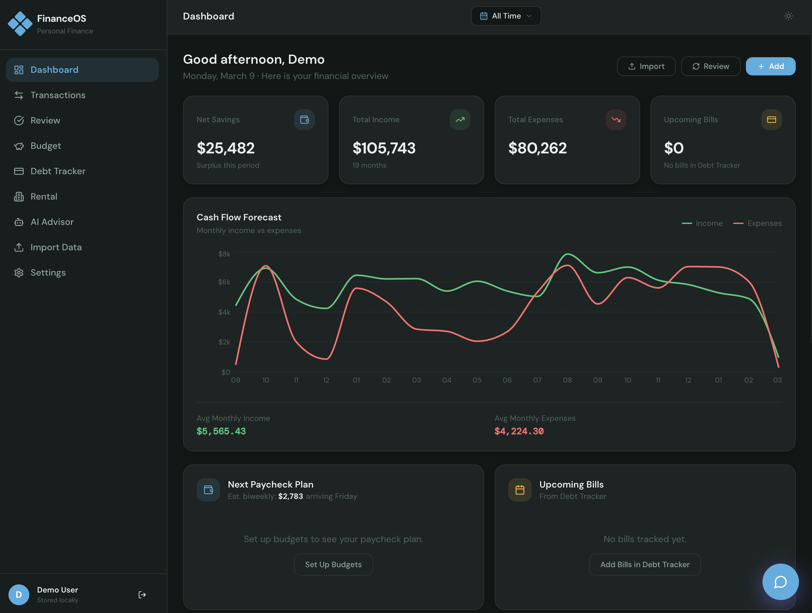
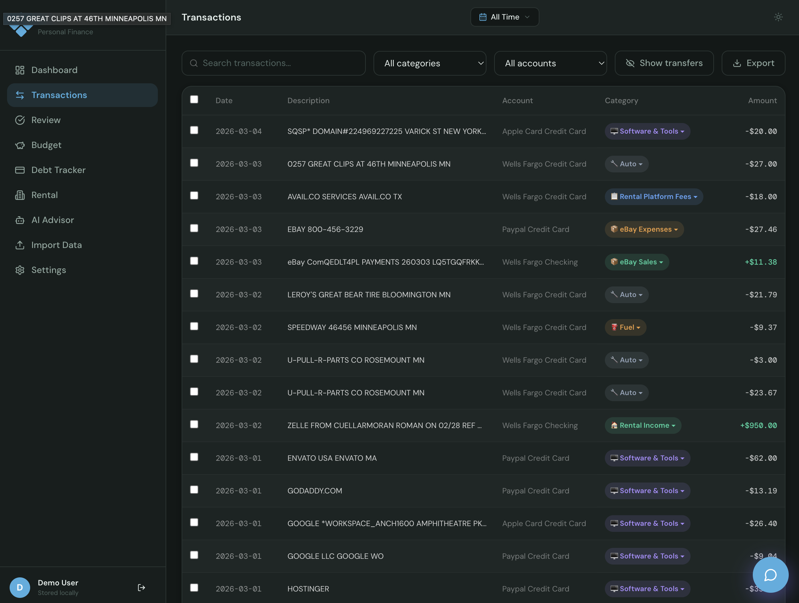
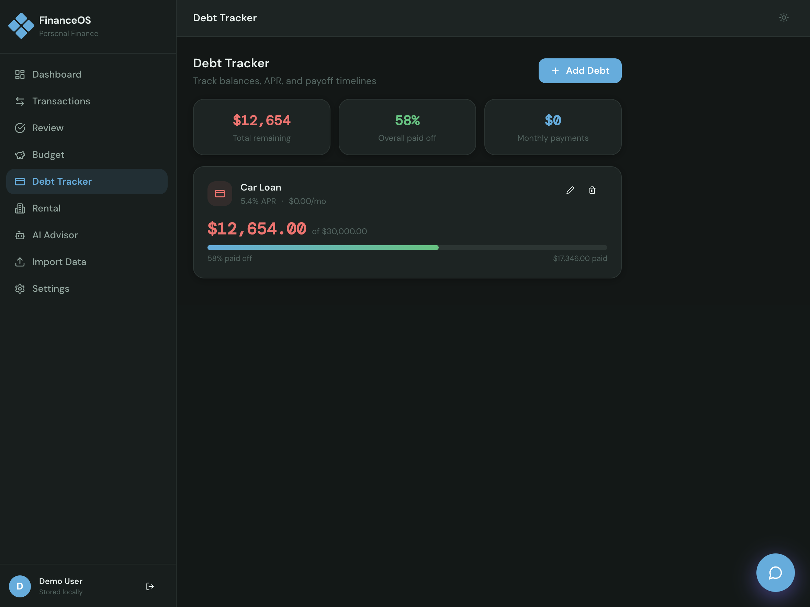
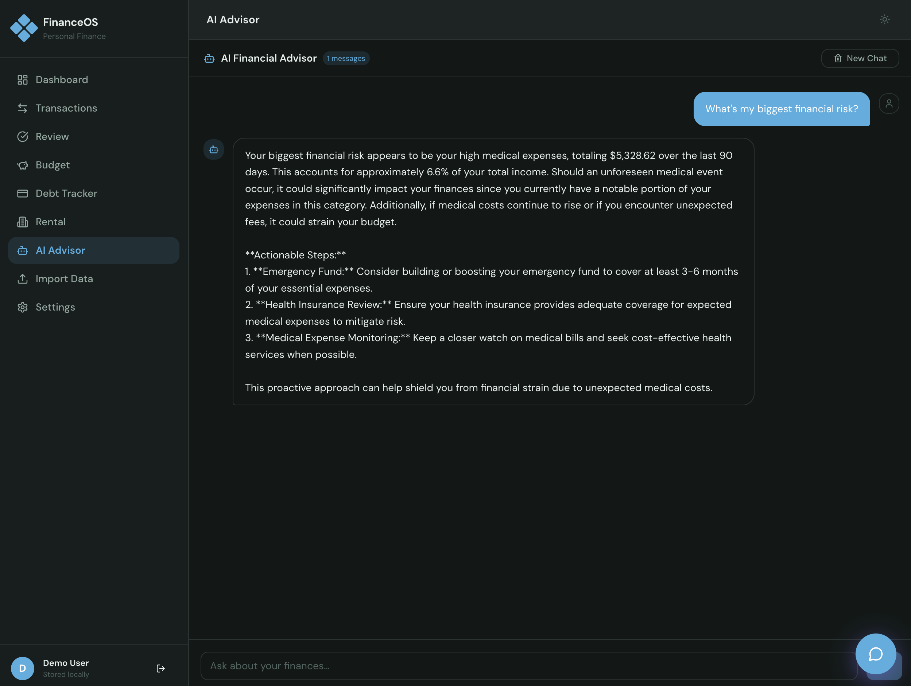
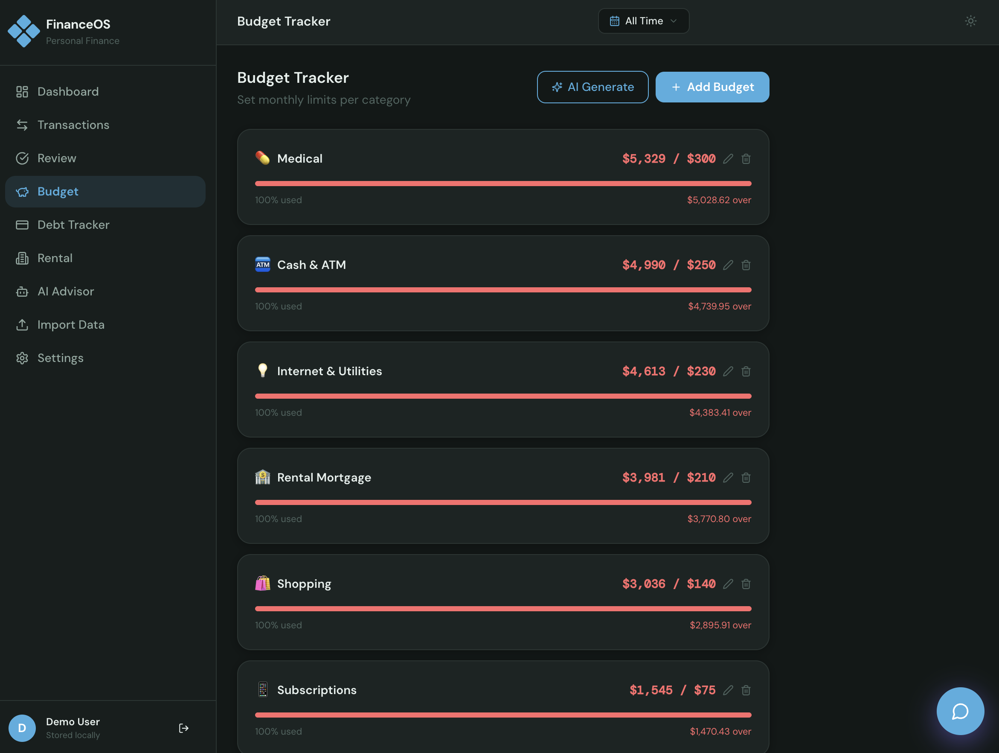
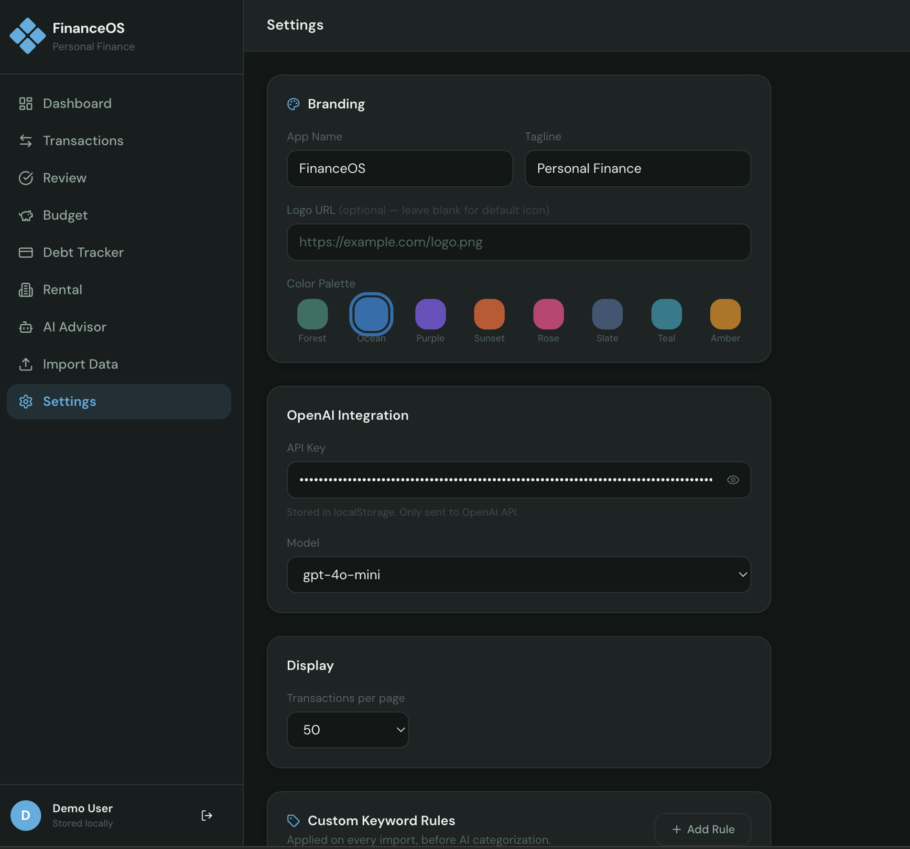
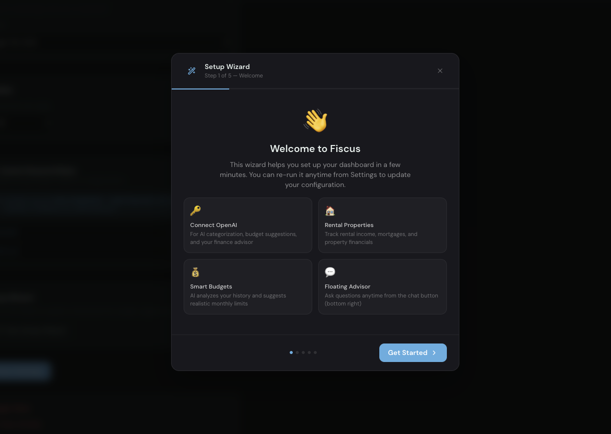

# Fiscus — AI-Powered Personal Finance Dashboard

[](https://github.com/thomasjvalenzuela/fiscus-ai-finance/actions/workflows/ci.yml)
[](./LICENSE)
[](https://react.dev)
[](https://vitejs.dev)
[](https://tailwindcss.com)

> **Named after the *fiscus* — the personal treasury of the Roman Emperor.**
> Your finances, centralized. Nothing leaves your device.

Fiscus is a **self-hosted, open-source personal finance dashboard** — similar in spirit to Firefly III, but built as a zero-dependency browser app. No Docker, no PHP, no database setup. Clone the repo, run two commands, and it's live in your browser.

Import your bank transactions, track budgets, monitor debt payoff, and get AI-powered financial insights — entirely locally, with no server, no data collection, and no subscription.

---

## Installation

### Requirements

| Requirement | Version | Download |
|---|---|---|
| **Node.js** | 18 or later (20 LTS recommended) | [nodejs.org](https://nodejs.org) |
| **npm** | Included with Node.js | — |
| **Git** | Any recent version | [git-scm.com](https://git-scm.com) |

---

### macOS

**Option A — Homebrew (recommended)**

If you don't have Homebrew installed, get it at [brew.sh](https://brew.sh), then:

```bash
brew install node git
```

**Option B — Direct installer**

Download and run the macOS installer from [nodejs.org/en/download](https://nodejs.org/en/download). Git is pre-installed on macOS (it will prompt you to install Xcode Command Line Tools the first time you use it).

**Install and run Fiscus:**

```bash
git clone https://github.com/thomasjvalenzuela/fiscus-ai-finance.git
cd fiscus-ai-finance
npm install
npm run dev
```

Open your browser to **[http://localhost:5173](http://localhost:5173)**.

---

### Windows

**Step 1 — Install Node.js**

Download the Windows installer (`.msi`) from [nodejs.org/en/download](https://nodejs.org/en/download).
Run the installer and accept the defaults. This also installs npm.

Or with winget:
```powershell
winget install OpenJS.NodeJS.LTS
```

Or with Chocolatey:
```powershell
choco install nodejs-lts
```

**Step 2 — Install Git**

Download from [git-scm.com/download/win](https://git-scm.com/download/win) and run the installer.
Accept all defaults. "Git Bash" will be installed alongside it.

**Step 3 — Clone and run**

Open **Command Prompt**, **PowerShell**, or **Git Bash**:

```powershell
git clone https://github.com/thomasjvalenzuela/fiscus-ai-finance.git
cd fiscus-ai-finance
npm install
npm run dev
```

Open your browser to **[http://localhost:5173](http://localhost:5173)**.

> **Windows Firewall:** If prompted, allow Node.js through the firewall. The app only listens on `localhost` — it is not exposed to your network.

---

### Linux

```bash
# Debian / Ubuntu
curl -fsSL https://deb.nodesource.com/setup_20.x | sudo -E bash -
sudo apt-get install -y nodejs git

# Fedora / RHEL
sudo dnf install nodejs git

# Arch
sudo pacman -S nodejs npm git
```

```bash
git clone https://github.com/thomasjvalenzuela/fiscus-ai-finance.git
cd fiscus-ai-finance
npm install
npm run dev
```

---

### Try the Demo

Once the app opens, click **"Try Demo"** on the login screen. A full set of realistic sample data loads instantly — no account creation needed. This is the best way to explore every feature before setting up your own account.

---

### Updating to a new version

```bash
cd fiscus-ai-finance
git pull
npm install
npm run dev
```

That's it. Because there is no database or server, updates never require migrations.

---

---

## Screenshots

| Dashboard | Transactions | Debt Tracker |
|---|---|---|
|  |  |  |

| AI Advisor | Budget | Settings |
|---|---|---|
|  |  |  |

| Setup Wizard |
|---|
|  |

---
---

## Features

### Implemented

| Feature | Description |
|---|---|
| **Dashboard overview** | Greeting bar, 4 KPI cards (net savings, income, expenses, upcoming bills), cash flow chart, paycheck allocation, weekly finance workflow checklist, expense donut, recent transactions |
| **Transaction management** | Full ledger with search, filter, sort, inline category editing, and manual entry |
| **CSV import** | Drag-and-drop import of standard bank transaction exports |
| **Auto-categorization** | Rule-based categorization with AI-assisted review queue (groups by keyword, shows confidence) |
| **Budget tracking** | Monthly budgets per category with live progress bars, overspend alerts, and AI-suggested amounts |
| **Debt tracker** | Balance, APR, monthly payment input. Payoff ETA with extra-payment scenarios (+$50, +$100, +$200/month) |
| **AI Advisor** | GPT-4o powered financial chat. Persistent history across sessions with "New Chat" reset |
| **Secure local auth** | Username/password login. Passwords hashed via SubtleCrypto SHA-256. Per-user namespaced storage |
| **Demo mode** | One-click login with realistic seeded data — no signup required |
| **Dark / light mode** | Respects system preference, manual toggle available |
| **Branding customization** | App name, tagline, logo URL, and 8 color palettes (Forest, Ocean, Purple, Sunset, Rose, Slate, Teal, Amber) |
| **Responsive layout** | Mobile, tablet, and desktop — no manual reformatting needed |

### In Progress

- [ ] Recurring transaction detection and flagging
- [ ] Net worth tracker (assets vs. liabilities)
- [ ] Monthly financial health score (0–100)

### Planned

- [ ] CSV export with date and category filters
- [ ] Multi-account support (checking, savings, credit card)
- [ ] Optional bank connection via Plaid API
- [ ] Progressive Web App (PWA) with offline support
- [ ] Weekly email digest via Resend API

---

## Tech Stack

| Layer | Technology |
|---|---|
| Framework | React 18 (hooks only, no class components) |
| Build tool | Vite 6 |
| Styling | Tailwind CSS 3 + CSS custom properties for palette theming |
| Charts | Recharts 2 |
| Icons | Lucide React |
| AI | OpenAI API (GPT-4o) — optional, browser-direct, key stored locally |
| CSV parsing | Papa Parse |
| Auth crypto | Web Crypto API (SubtleCrypto SHA-256) |
| Storage | Browser `localStorage` — zero backend |

---

## AI Features

AI features are **optional** — the app works fully without them.

To enable, add your OpenAI API key in **Settings → AI Integration**, or via `.env`:

```bash
cp .env.example .env
# Add VITE_OPENAI_API_KEY=sk-...
```

API calls are made **directly from your browser to OpenAI**. The key is never sent to any intermediate server.

Recommended model: `gpt-4o-mini` — fast and inexpensive for personal use.

---

## Project Structure

```
fiscus-ai-finance/
├── index.html
├── vite.config.js
├── tailwind.config.js
├── .env.example
├── src/
│   ├── main.jsx                  # Entry point
│   ├── App.jsx                   # Root — auth flow, routing, global state
│   ├── index.css                 # Global styles + CSS variable theming
│   ├── lib/
│   │   ├── authStore.js          # Login, registration, sessions, SHA-256 hashing
│   │   ├── storage.js            # localStorage abstraction with per-user namespacing
│   │   ├── demoSeed.js           # Synthetic demo dataset (transactions, budgets, debts)
│   │   ├── openai.js             # OpenAI API client wrapper
│   │   ├── categorizer.js        # Rule-based transaction categorization
│   │   └── palettes.js           # 8 color palettes + CSS variable application
│   └── components/
│       ├── LoginPage.jsx         # Auth screen with demo login button
│       ├── SetupWizard.jsx       # First-run onboarding flow
│       ├── Sidebar.jsx           # Navigation + branding
│       ├── Header.jsx            # Top bar — date range, theme toggle, user menu
│       ├── Dashboard.jsx         # Overview — KPIs, charts, workflow checklist
│       ├── TransactionList.jsx   # Full transaction ledger
│       ├── BudgetPage.jsx        # Budget management
│       ├── DebtTracker.jsx       # Debt payoff calculator and scenarios
│       ├── ImportPage.jsx        # CSV import
│       ├── AIAdvisor.jsx         # Persistent AI chat
│       ├── FloatingChat.jsx      # Floating AI assistant overlay
│       ├── ReviewQueue.jsx       # AI-assisted categorization queue
│       └── SettingsPage.jsx      # Preferences, branding, data management
├── docs/
│   ├── architecture.md           # System design and data flow
│   ├── data-model.md             # localStorage schema reference
│   ├── product-decisions.md      # Design rationale and trade-offs
│   └── deployment.md             # Hosting options and deploy guide
├── .github/
│   ├── workflows/ci.yml          # GitHub Actions — lint + build on every push
│   ├── ISSUE_TEMPLATE/           # Bug report and feature request templates
│   └── PULL_REQUEST_TEMPLATE.md
├── CHANGELOG.md
├── CONTRIBUTING.md
└── SECURITY.md
```

---

## Architecture

Fiscus is a **zero-backend SPA**. No server, no database, no API gateway.

```
Browser
  └─ Vite SPA (React 18)
       ├─ Auth layer        authStore.js  →  SHA-256 hash  →  localStorage
       ├─ Storage layer     storage.js    →  fiscus_u_{user}_{key}  →  localStorage
       ├─ UI layer          components/
       │    ├─ Dashboard    → aggregated summary view
       │    ├─ Transactions → CRUD + CSV import
       │    ├─ Budgets      → category spend tracking
       │    ├─ DebtTracker  → compound interest payoff math
       │    └─ AIAdvisor    → direct OpenAI API calls (browser → api.openai.com)
       └─ Theming           palettes.js   →  CSS custom properties (8 palettes × 2 modes)
```

See [`docs/architecture.md`](./docs/architecture.md) for the full breakdown.

---

## Data & Privacy

- **No server.** Nothing is sent anywhere except optional direct calls to `api.openai.com`.
- **No tracking.** No analytics, no telemetry, no cookies, no third-party scripts.
- **Passwords hashed locally.** SubtleCrypto SHA-256 — the plain-text password is never stored.
- **Your API key stays local.** Stored in `localStorage` only, never transmitted to any intermediate server.
- **Demo mode is safe.** "Try Demo" loads 100% synthetic data. No real financial information.

See [`SECURITY.md`](./SECURITY.md) for the complete security model.

---

## Deployment

This is a pure static SPA — build once, deploy anywhere.

```bash
npm run build   # outputs to dist/
```

| Host | Notes |
|---|---|
| **Vercel** | Connect GitHub repo → set framework to Vite → deploys automatically |
| **Netlify** | Drag `dist/` into Netlify Drop, or connect repo |
| **GitHub Pages** | See [`docs/deployment.md`](./docs/deployment.md) for the Pages-specific config |

See [`docs/deployment.md`](./docs/deployment.md) for detailed instructions.

---

## Contributing

Contributions are welcome. Please read [`CONTRIBUTING.md`](./CONTRIBUTING.md) before opening a PR.

For bugs or feature ideas, [open an issue](https://github.com/thomasjvalenzuela/fiscus-ai-finance/issues) using the provided templates.

---

## License

[MIT](./LICENSE) — free to use, modify, and deploy.
